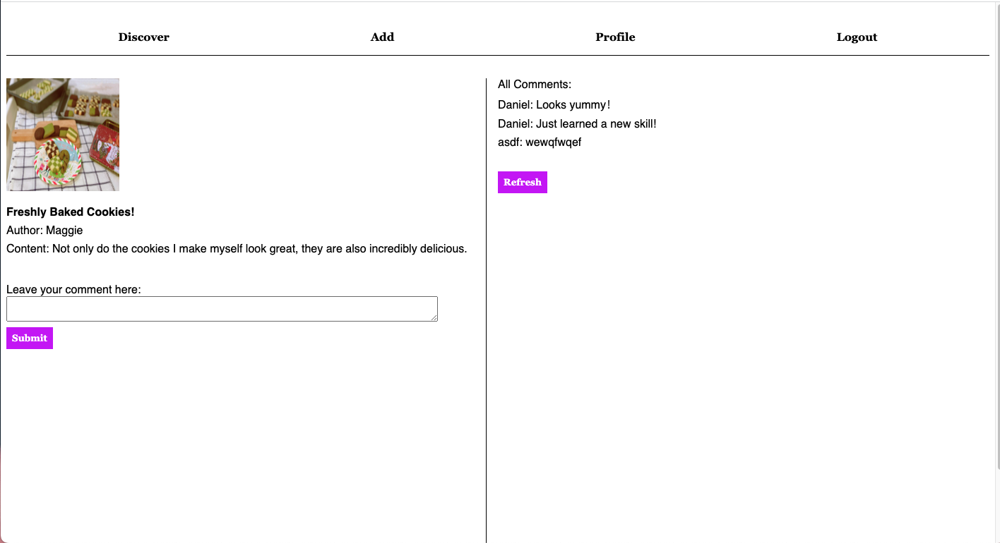

# LifeShare

LifeShare is a dynamic social media platform that fosters a thriving lifestyle community. The platform seamlessly blends user-generated content, including photos and text, to create personalized lifestyle content that showcases the latest trends and products.
Users can record life details in the form of short videos, pictures and texts, share lifestyles, and form interactions based on interests.

## Installation

Use the command below to run the project.

```bash
npm install
npm run build
npm start
```

## Usage

### Landing Page
When you enter this website, you will be directed to the login page, where the login area is located on the left side. To access all pages of the website and view the details of other users' posts, users must log in with a valid username. (Valid username should not be empty or the word 'dog'. It must only consist of alphanumeric characters.)


On the right side of the login page, all posts from other users are publicly accessible to anyone visiting the website. However, non-logged-in users can only preview all posts and cannot view specific details of each post. In contrast, logged-in users have full access to all pages and can view specific details of each post. All users can click the 'Previous', 'Next', 'First', and 'Last' buttons to navigate between pages. 


*Note*: The source code contains two sample posts

### Menu
The different pages in this website can be navigated through the button in the top menu bar. 


### Discover Page
After logging in, users will be directed to the Discover page where they can view all posts from all users. To view the specific detail of any post of interest, users can simply click on the post image, title, author name, or comments. Additionally, users can navigate through the pages using the 'Previous', 'Next', 'First', and 'Last' buttons to view posts on the previous page, next page and the first page, and the last page respectively.


### Discover Page - Post Details Page
When the user is on the Post Details Page, they will see the image, title, author, and content of the current post. Users can leave comments on each post (comments cannot be blank) and view comments from other users on the right-hand side of the post details. To fetch the latest comments from the server, simply click the 'Refresh' button.



### Add page 
On the 'Add' page, users can create their own posts by selecting an image file (the file must be in the form of a JPG or PNG), entering a post title and content (the title cannot be blank or more than 20 characters and the content cannot be left blank.), and clicking the 'Upload' button to submit their post. Once submitted, users can view their latest post on the Discover page by clicking the 'Last' button (all posts on the site are sorted chronologically). Users can also view all of their posts on the Profile page (see next section).


##### New post showing up on Discover page

##### New post showing up on Profile page


### Profile page 
On the Profile page, users can click the 'Modify' button to update their Bio as needed. The updated Bio cannot be blank or more than 50 characters. Additionally, users can view all of their posts on the Profile page and delete them by clicking the 'Delete' button. Once deleted, the corresponding post on the Discover page will also be removed.


### Logout
The menu bar includes a Logout button on the far right side. Clicking the Logout button will log the user out of their account and redirect them to the login page. To resume their login, users simply need to enter their username, and all their information will be saved, as long as the server has not been stopped.


## Contributing

Pull requests are welcome. 

## Authors

Qian Li: 7qianli@gmail.com

## License

[MIT](https://choosealicense.com/licenses/mit/)
